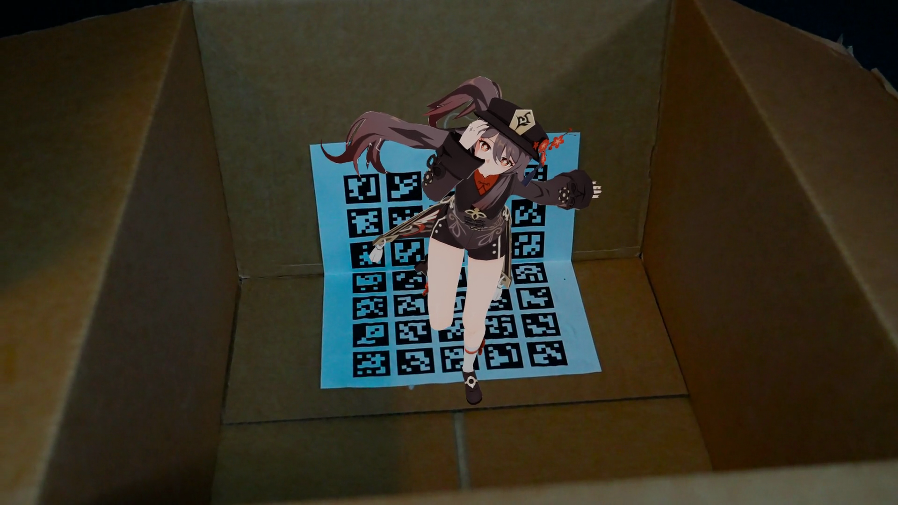
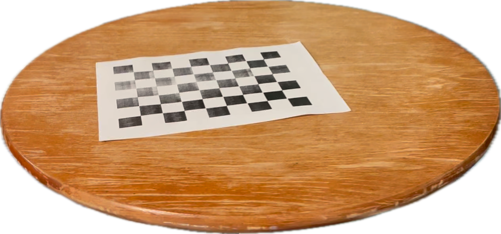
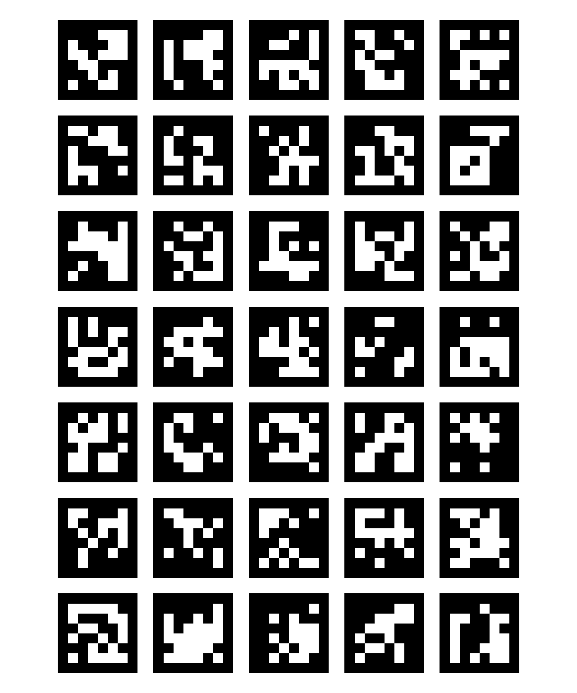
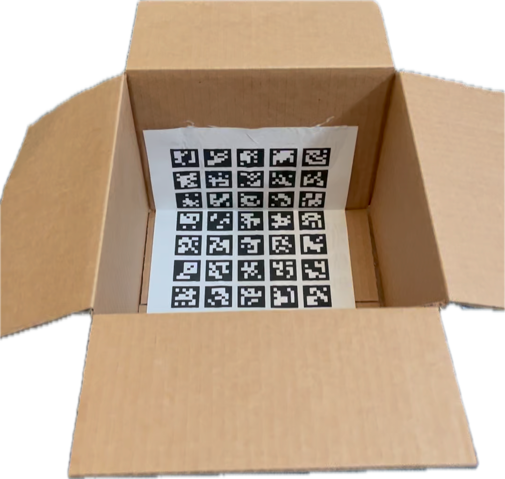
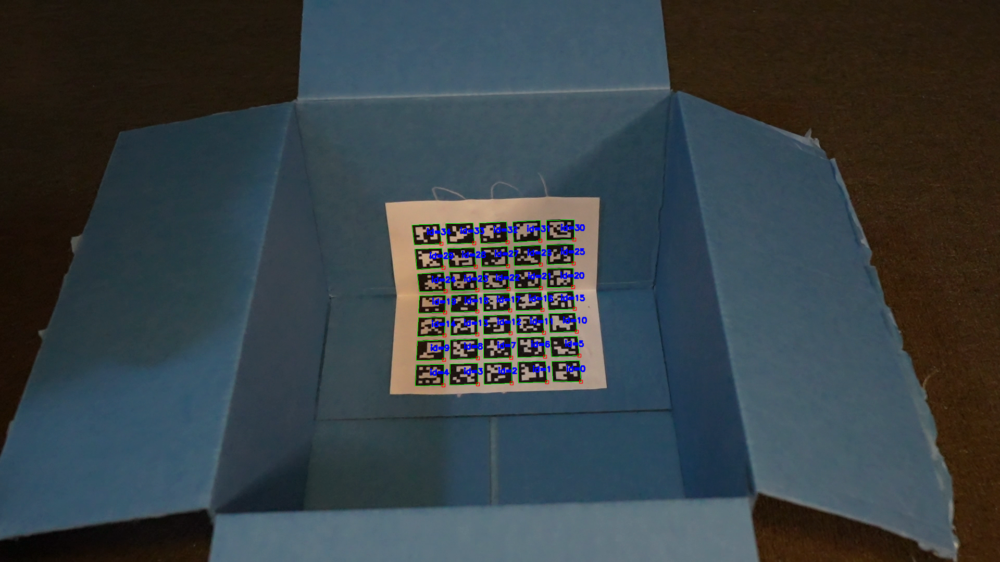
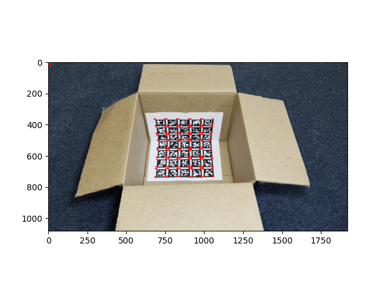
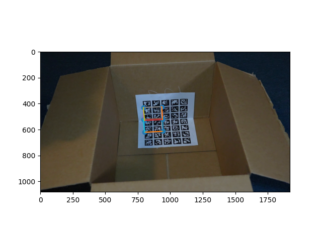
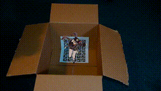

# Poor Man's Augmented Reality

## Setup and Methodology

### Initial Attempts

1. **Checkerboard Detection**: Initially, I used `findChessboardCorners` for keypoint detection. However, this method proved inefficient as it requires the camera to be perpendicular to the checkerboard, and the checkerboard to occupy most of the image.

   

2. **ArUco Markers**: Next, I implemented ArUco markers. The `detectMarkers` function showed resistance to rotation and translation but struggled with motion blur. Although satisfactory for basic tasks, using two 2D ArUco boards for camera calibration yielded unstable results, with the intrinsic matrix and distortion coefficients varying significantly.

   

### Refined Approach

To address these challenges, I employed a 3D ArUco board, folding a 2D board into a 90-degree angle. This approach stabilized the z-axis and provided consistent intrinsic matrix and distortion coefficients.

## Keypoints Detection

I used a 5x7 ArUco board for camera calibration. The `aruco::detectMarkers` function successfully detected the board, returning the corners in the image.

## Calculating the Projection Matrix

We can determine the projection matrix using the least squares method. By defining a corner of the board as the origin of the world coordinate system, we can establish a relationship between 3D corner coordinates $P_w$ and their corresponding 2D image coordinates $P_i$:

$$
    P_i = M_{3 \times 4} P_w
$$

where $M_{3 \times 4}$ is the projection matrix. With a sufficient number of points, we can minimize the error in $M$ through least squares optimization:

$$
    \min_{M} \sum_{i=1}^{N} \|P_i - M_{3 \times 4} P_w\|^2 
$$

## Propagating Keypoints to Other Frames

For keypoint propagation, I generated 12x12 bounding boxes for each corner on the board. I then employed `cv::MultiTracker` with the CSRT algorithm to track these bounding boxes across frames.

## Camera Calibration

I calibrated the camera using the 3D and 2D coordinates of the board's corners, with 3D coordinates representing their positions in the world coordinate system.

Extracting the camera's rotation and translation from the projection matrix was straightforward, given the orthogonality of the rotation matrix.

## Augmented Reality Visualization

### Projecting a Cube

Using the projection matrix, I reprojected the board's corners back into the image and demonstrated the projection of a unit cube.

### Projecting a 3D Model

With the camera's pose (rotation vector, translation vector, and intrinsic matrix), I projected 3D models into the scene. As an example, I rendered a 3D model of Hutao from Genshin Impact.

